*I built a discrete diffusion language model from scratch to understand every line of math and code.*

---

Here's everything I learned — from probability basics to the ELBO collapse to a working model that generates Shakespeare in parallel.

Every language model you use today — GPT, Claude, LLaMA, Gemini — generates text the same way. Left to right. One token at a time. Each word is committed before the next one is considered.

But what if a language model could work like an artist instead? Start with a blank canvas, sketch rough outlines, and progressively refine everything at once until the text is sharp?

That's what diffusion language models do. And recently, this stopped being theoretical — Inception Labs shipped Mercury, a commercial dLLM doing 1,000+ tokens/sec in production. I attended a fireside chat with Stefano Ermon (CEO of Inception, co-inventor of score-based diffusion) at Stanford GSB, and hearing him describe the paradigm made me want to build one from the ground up.

So I built [microDLM](https://github.com/BrutalCaeser/microDLM): a 10.7M parameter discrete diffusion language model trained on Tiny Shakespeare, implemented from scratch in PyTorch. Same architecture as GPT, same data, same transformer — with exactly five changes.

This post walks through every mathematical idea behind it. No hand-waving. No "it can be shown that." Every symbol earned.

> 🎮 **[Try the interactive demo →](https://brutalcaeser.github.io/microDLM/)** — watch diffusion race GPT live in your browser.

<!--more-->

---

## The Core Idea in 30 Seconds

A GPT model generates "to be or not to be" like this:

```
Step 1:  to
Step 2:  to be
Step 3:  to be or
Step 4:  to be or not
Step 5:  to be or not to
Step 6:  to be or not to be
```

Each token is final the moment it's placed. The model never reconsiders.

A diffusion model generates the same text like this:

```
Step 0:  _ _ _ _ _ _           (start: everything masked)
Step 1:  _ _ _ _ _ be          (unmask the most confident prediction)
Step 2:  _ be _ _ _ be         (unmask next most confident)
Step 3:  to be _ not _ be      (several unmasked at once)
Step 4:  to be or not to be    (fill in the rest)
```

The model sees the entire sequence at every step. It commits to its most confident guesses first, then revisits uncertain positions with more context each round.

> The paradigm shift isn't in the architecture. It's in the generation process. GPT is a typewriter. Diffusion is an editor revising a full draft.

That's it. Everything below is the math and engineering that makes "start from nothing, refine in parallel" a principled, trainable algorithm.

---

## Part 1: The Forward Process — Erasing Text with Math

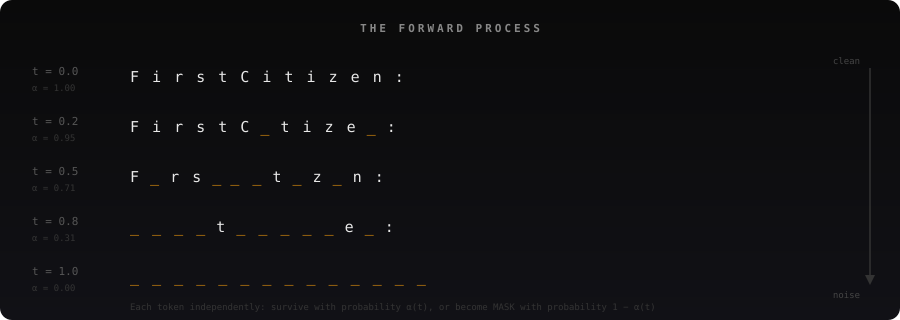

Before we can train a model to recover text from noise, we need to define what "noise" means for text.

In image diffusion, noise is Gaussian static added to pixels. But you can't "blur" the letter 'e' into something between 'e' and 'f'. Text is discrete. Characters are distinct objects with no smooth space between them.

The solution is elegant: replace characters with a blank token. Call it MASK (written as `_`). The "noising" process is just an eraser.

For a single character at time $t$, only two things can happen:

$$P(\text{character survives}) = \alpha(t)$$
$$P(\text{character is erased}) = 1 - \alpha(t)$$

$\alpha(t)$ is a schedule that starts at 1 (nothing erased at time 0) and decreases to 0 (everything erased at time 1). Each character is erased independently — its own coin flip.

> Each token flips a coin. Heads it survives, tails it becomes nothing. That's the entire forward process.

This is called the **absorbing-state forward process**, from D3PM (Austin et al., 2021). "Absorbing" because MASK is a trap — once a character becomes `_`, it stays `_` forever during corruption. It never spontaneously turns back into a real character.

Here's what this looks like on real Shakespeare, using a cosine schedule $\alpha(t) = \cos(\pi t / 2)$:

```
t=0.0  "First Citizen: Before we proceed any further, hear me speak."
t=0.2  "First C_tize_: Before w_ proceed _ny furth_r, he_r me speak."
t=0.5  "F_rs_ _i__z__:__ef_r_ __ _r_ce__ _ny f_rth__,_h__r m_ s_e_k."
t=0.8  "____t _____e_:_______e __ _______ ___ ______r_ ____ __ ___a_."
t=1.0  "______________________________________________________________"
```

Why cosine and not linear? A linear schedule drops at a constant rate. A cosine schedule spends more time at intermediate masking levels — roughly 30-70% masked — where the learning signal is richest. At very light masking, there's almost nothing to predict. At very heavy masking, there's almost no context to predict from. The productive zone is the middle, and cosine lingers there.

### In code: two lines of real logic

```python
def forward_process(x, t, mask_token_id):
    alpha_t = math.cos(t * math.pi / 2)              # cosine schedule
    mask = torch.rand_like(x.float()) > alpha_t       # independent coin flip per token
    noisy_x = x.clone()
    noisy_x[mask] = mask_token_id                     # replace with MASK
    return noisy_x, mask
```

The `mask` boolean tensor is returned because the training loss is computed only at masked positions. Why only masked positions? That's where the derivation comes in.

---

## Part 2: The Training Objective — Why Cross-Entropy at Masked Positions Is All You Need

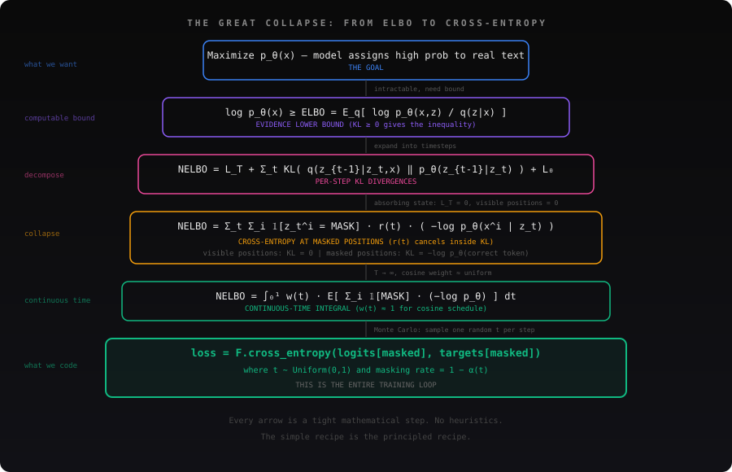

### The goal

We have clean text $x$ (Shakespeare). We have a model with parameters $\theta$. We want the model to assign high probability to real text: maximize $\log p_\theta(x)$.

### The problem

The diffusion model generates through a chain of latent states $z_1, z_2, \ldots, z_T$ (progressively less noisy). Computing $p_\theta(x)$ exactly requires summing over every possible denoising path:

$$p_\theta(x) = \sum_{\text{all possible } z \text{ chains}} p_\theta(x, z_1, \ldots, z_T)$$

How many paths? For a sequence of length $L$ with $T$ timesteps, each position at each step is either masked or unmasked, giving $2^{L \times T}$ paths. For realistic values ($L=256$, $T=1000$), that's $2^{256000}$. An impossibly large sum.

### The ELBO: a computable lower bound

Instead of computing the sum, we find a lower bound on $\log p_\theta(x)$ and maximize that instead.

The derivation starts from one exact identity — for any distribution $q(z|x)$:

$$\log p_\theta(x) = \text{ELBO} + \text{KL}(q(z|x) \| p_\theta(z|x))$$

Since KL divergence is always $\geq 0$ (a provable fact — you can't be negatively surprised on average when using the wrong distribution):

$$\log p_\theta(x) \geq \text{ELBO}$$

Maximizing the ELBO pushes up $\log p_\theta(x)$. Exactly what we want.

### Breaking it into timesteps

When you plug in the factored forward process $q$ (our masking schedule — fixed, not learned) and the factored reverse process $p_\theta$ (our transformer — the thing we're training), expand the logs, and apply Bayes' rule (a telescoping cancellation happens), the ELBO decomposes into per-step KL divergences:

$$\text{NELBO} = L_T + \sum_{t=2}^{T} L_t + L_0$$

where each $L_t = \text{KL}(q(z_{t-1}|z_t, x) \| p_\theta(z_{t-1}|z_t))$ asks: "at noise level $t$, how close is the model's reverse prediction to the true reverse step?"

### The absorbing-state collapse

This is where the math gets elegant. I spent days working through this derivation by hand, and the moment every KL term collapsed to simple cross-entropy was when the whole framework clicked.

For absorbing-state diffusion, each $L_t$ breaks down position by position. At each position, there are exactly two cases:

**Visible positions (not masked):** both the true reverse and the model agree — the token stays put. $\text{KL} = 0$. No learning signal. No computation needed.

**Masked positions:** the true reverse knows the correct token (it has access to clean data). It's a delta function — "the answer is 'e', period." The KL between a delta function and the model's distribution collapses to:

$$\text{KL} = r(t) \cdot (-\log p_\theta(\text{correct token} | \text{noisy input}))$$

That's cross-entropy. Scaled by $r(t)$, a time-dependent weight that gets absorbed into the schedule.

> The ELBO for absorbing-state diffusion collapses to something almost embarrassing in its simplicity: **cross-entropy at masked positions**. The same loss BERT uses — but now with full theoretical backing as a variational bound.

---

## The Full Derivation — My Notes

I worked through this derivation by hand to make sure I wasn't fooling myself with abstractions. Here's the complete chain from the ELBO identity to the masked cross-entropy loss. Nothing skipped.

### Step 1: The ELBO identity and why it's a bound

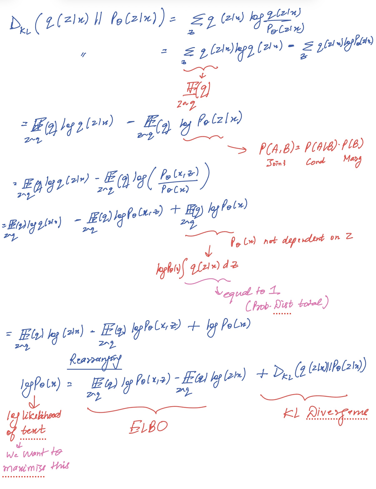

Start from the KL divergence between $q(z|x)$ and $p_\theta(z|x)$. Expand it, apply Bayes' rule to $p_\theta(z|x) = p_\theta(x,z)/p_\theta(x)$, and rearrange. You get:

> $\log p_\theta(x) = \text{ELBO} + \text{KL}(q \| p_\theta)$

The $\text{KL} \geq 0$ proof is on the right side of this page — it uses the fact that $\log(u) \leq u-1$ for all positive $u$. Apply this inside the KL sum, and both distributions summing to 1 gives you $1-1 = 0$ as the upper bound on $-\text{KL}$. Therefore $\text{KL} \geq 0$, and the ELBO is a lower bound.

The bottom of this page factors $q$ and $p_\theta$ into their timestep components — setting up the expansion in the next step.

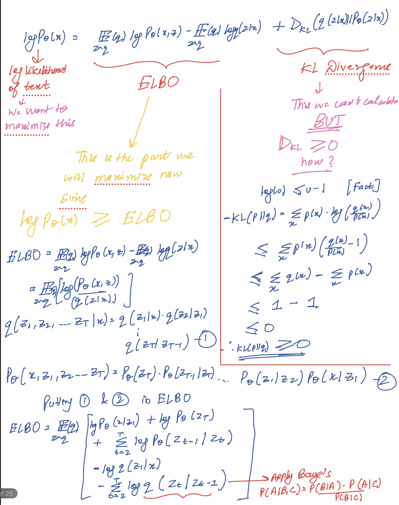
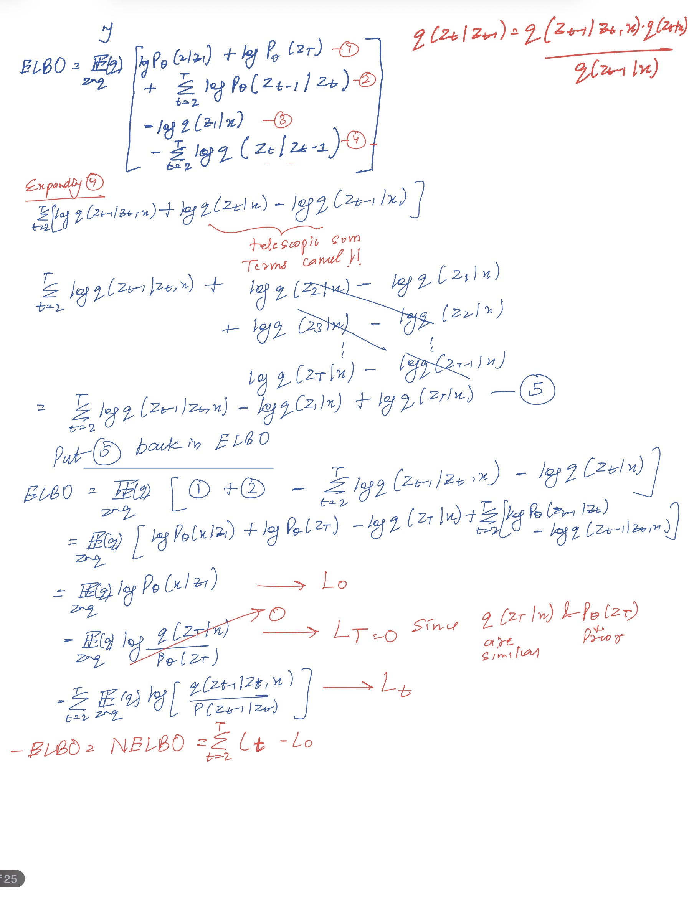

This picks up from the factored ELBO. The top of the page shows Bayes' rule applied to introduce the true reverse posterior $q(z_{t-1}|z_t, x)$. The log terms form a telescoping sum — the strikethrough marks show intermediate terms cancelling pairwise. What survives is the clean decomposition at the bottom:

> $\text{NELBO} = L_0 + \sum L_t$ (with $L_T = 0$ since $q(z_T|x)$ and $p(z_T)$ both equal all-MASK)

Each $L_t$ is a KL divergence: "at noise level $t$, how close is the model to the truth?"

### Step 2: The two cases — where the KL collapses

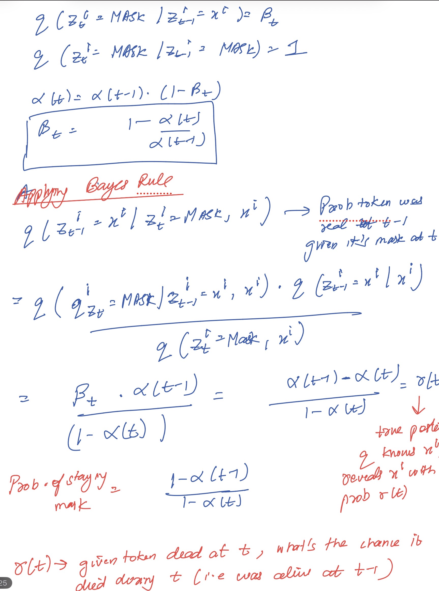

This is where absorbing-state diffusion pays off. For each position $i$ at timestep $t$, there are exactly two cases.

**Case 1 (position is visible):** both $q$ and $p_\theta$ agree: copy the token with probability 1. $\text{KL} = 0$. No learning signal.

**Case 2 (position is masked):** going backward one step, the token was either just freshly masked (was alive at $t-1$) or was already masked before. The probability it was freshly masked — that's $r(t)$.

The bottom of this page derives $r(t)$ from the forward process marginals using Bayes' rule:

$$r(t) = \frac{\alpha(t-1) - \alpha(t)}{1 - \alpha(t)}$$

The intuition: $r(t)$ is the detective's question. You find a dead soldier after zone $t$ — what's the probability they died in this specific zone? The numerator is how many fell here ($\alpha(t-1) - \alpha(t)$), the denominator is how many are dead total ($1 - \alpha(t)$).

### Step 3: Computing the KL term by term

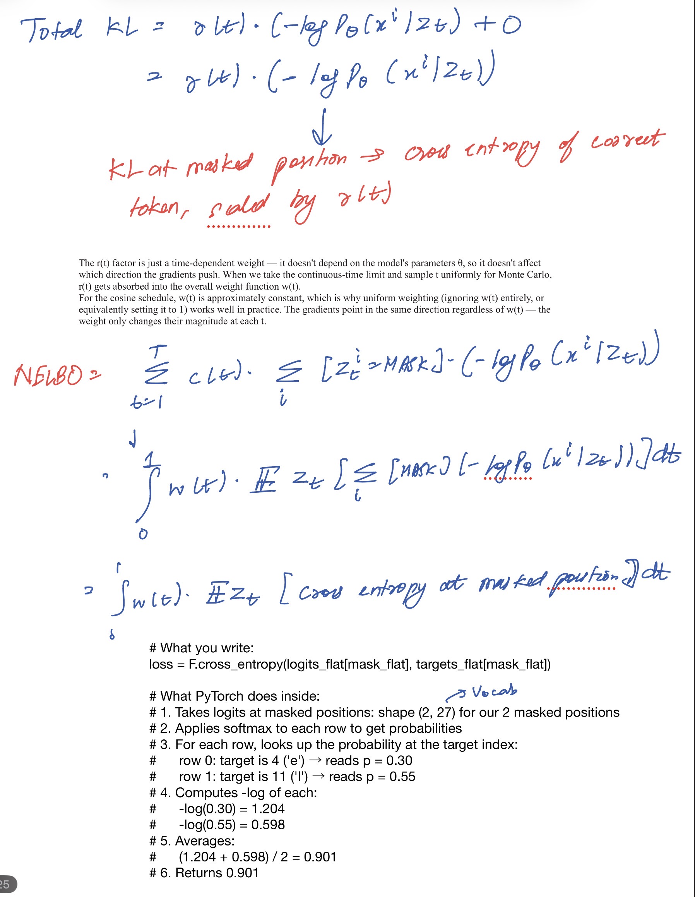

This is the page that makes it all concrete. The table lays out every possible outcome for $z_{t-1}^i$ and its probability under both $q$ (the truth) and $p_\theta$ (the model):

In the KL sum, terms where $q = 0$ contribute nothing. The MASK terms cancel perfectly (both assign $1-r(t)$). The only surviving term is:

$$\text{Term 1} = r(t) \cdot \log\frac{r(t)}{r(t) \cdot p_\theta(x^i|z_t)} = r(t) \cdot (-\log p_\theta(x^i|z_t))$$

> The KL at a masked position is just cross-entropy of the correct token, scaled by $r(t)$. The $r(t)$ factors inside the log cancel. What survives is $-\log p_\theta(\text{correct answer})$.

### Step 4: From integral to code

Sum across all timesteps and positions: the NELBO is a weighted sum of cross-entropy at masked positions. Take $T \to \infty$ for continuous time: the sum becomes an integral. The weight function $w(t)$ is approximately constant for the cosine schedule.

Approximate the integral by sampling one random $t$ per training step (Monte Carlo), and you arrive at the final recipe — the same line of PyTorch at the bottom of this page:

```python
loss = F.cross_entropy(logits[masked], targets[masked])
```

Every page of algebra collapses to this.

### The training recipe in code

```python
def compute_loss(model, x, mask_token_id):
    t = torch.rand(batch_size, 1)                                     # Monte Carlo: random noise level
    mask = torch.rand(batch_size, block_size) < t                     # forward process: mask tokens
    noisy_x = x.clone()
    noisy_x[mask] = mask_token_id                                     # corrupt

    logits = model(noisy_x)                                           # model predicts

    loss_all = F.cross_entropy(logits.view(-1, vocab_size), x.view(-1), reduction='none')
    mask_flat = mask.view(-1).float()
    loss = (loss_all * mask_flat).sum() / mask_flat.sum()             # loss on masked only
    return loss
```

Every line maps to a step in the derivation. Sample $t$ (Monte Carlo of the integral). Mask tokens (forward process $q$). Cross-entropy at masked positions (the collapsed KL). Average over masked positions (the expectation).

If you've used BERT, this looks familiar. BERT fixed the masking rate at 15% as a heuristic. Diffusion samples ALL rates and weights them to form a proper generative model. Same recipe, principled justification.

---

## Part 3: The Model — GPT with Five Surgical Changes

Here's what surprised me most building this:

> The diffusion model is not a new architecture. It's a standard transformer with five targeted modifications. Change one boolean and the loss function. That's the entire paradigm shift.

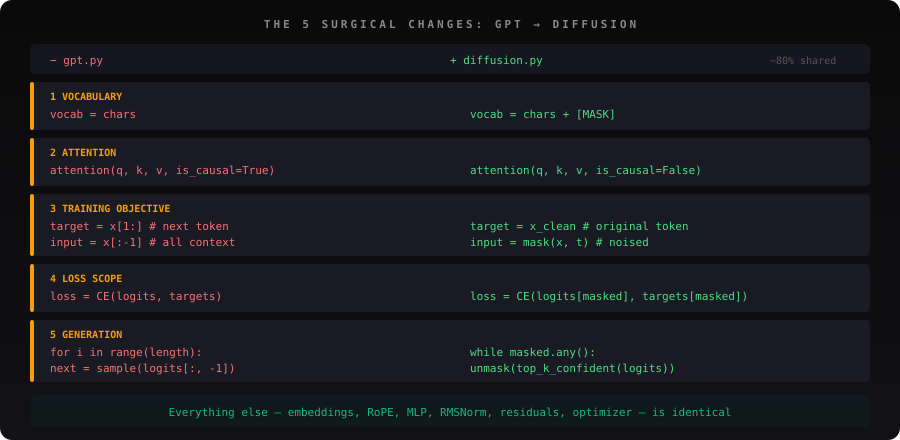

### Change 1: Add MASK to the vocabulary

```python
chars_with_mask = [MASK_CHAR] + chars    # one extra token
vocab_size = len(chars_with_mask)         # 66 chars + 1 MASK = 67
```

One extra row in the embedding table. The MASK token gets its own learned 384-dimensional vector, just like every real character.

### Change 2: Bidirectional attention

This is the single most important architectural change.

In GPT, position 5 can only see positions 0-5. A triangular mask sets attention scores for future positions to $-\infty$, which softmax converts to exactly 0 — those positions are invisible.

In diffusion, position 5 sees every position. A MASK at position 5 needs to gather information from position 8 (which might be a real token) to predict what it should be.

```python
# GPT:
y = F.scaled_dot_product_attention(q, k, v, is_causal=True)

# Diffusion:
y = F.scaled_dot_product_attention(q, k, v, is_causal=False)
```

One boolean.

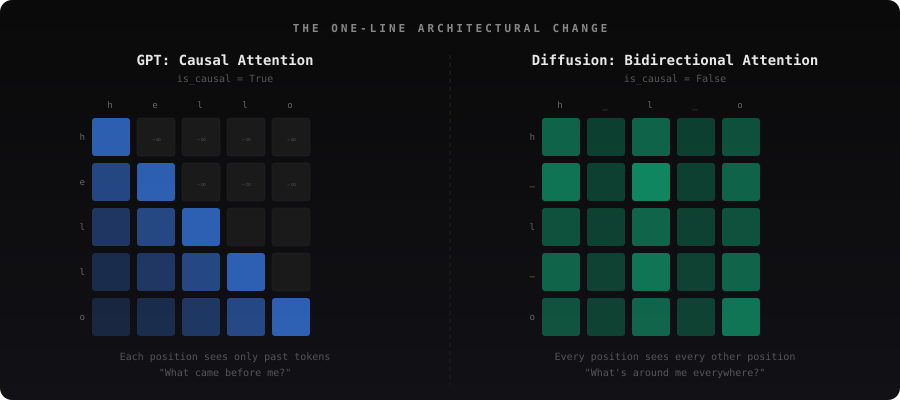

### Change 3: Denoising objective replaces next-token prediction

GPT: given tokens $0 \ldots i$, predict token $i+1$.

Diffusion: given a partially masked sequence, predict the original token at each MASK position.

### Change 4: Loss on masked positions only

GPT computes loss at every position — every token produces a training signal. Diffusion computes loss only where $z_t = \text{MASK}$.

Why? Because visible tokens are trivially known — the model can just copy them. Both the true reverse posterior and the model agree at those positions, so $\text{KL} = 0$. This is the "carry-over" from the SUBS parameterization we saw in the derivation, and it's a Rao-Blackwellization: by handling trivial positions analytically rather than estimating them, we reduce gradient variance.

Doesn't that waste half the training signal? Yes — on average, about 50% of tokens are masked per step. The model sees half as many supervised predictions per iteration as GPT. That's why we train diffusion for 10,000 steps vs GPT's 5,000 on the same data.

### Change 5: Parallel generation replaces sequential

Instead of generating one token at a time left-to-right, start from all MASKs and iteratively unmask in parallel, selecting the most confident predictions first.

One more subtle detail: **SUBS zero-masking**. Before softmax, set the MASK token's logit to $-\infty$ at every position. This forces the model to never predict MASK as an output. $\exp(-\infty) = 0$ exactly, so $P(\text{MASK}) = 0$.

```python
logits[:, :, mask_token_id] = float('-inf')    # SUBS zero-masking
```

---

## Part 4: Inside the Model — From Token IDs to Logits

What actually happens when you call `model(noisy_x)`?

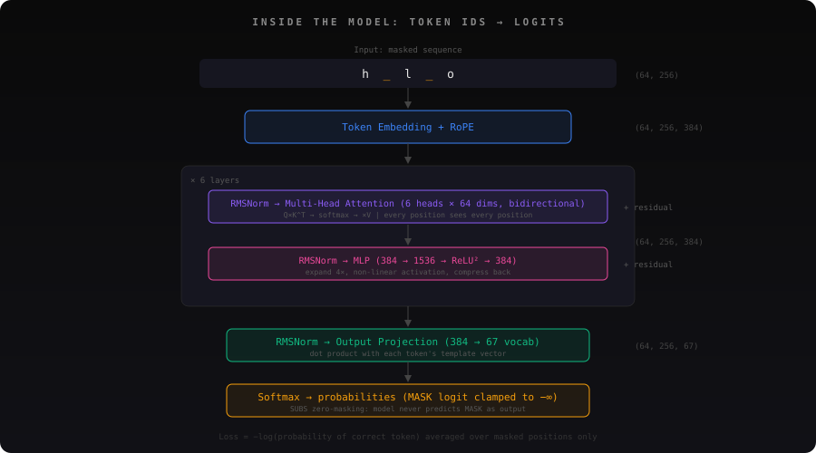

**Embedding:** Each token id becomes a 384-dimensional vector via a lookup table. MASK tokens at different positions start as identical vectors — the model must learn to distinguish them through positional information and context.

**RoPE (Rotary Position Embeddings):** Instead of adding a position vector, RoPE rotates query and key vectors by angles proportional to position. When position 5's query dots with position 3's key, the rotation encodes their distance ($5-3=2$) automatically. No separate position embedding is added.

**Multi-head attention (×6 heads):** The 384-dimensional vector splits into 6 heads of 64 dimensions each. Each head independently computes $Q \times K^T$ (attention scores), applies softmax (bidirectional — no mask!), and blends value vectors. Different heads specialize in different patterns: local spelling, word boundaries, structural markers. This specialization emerges from training.

After attention, a MASK token's vector is no longer the blank MASK embedding. It's a blend of contextual signals from all visible neighbors — encoding "the token between 'h' and 'l' is probably 'e'."

**MLP (384 → 1536 → ReLU² → 384):** Attention gathers context. The MLP processes it. The 4× expansion creates a high-dimensional space where ReLU² activation selectively fires different "feature detectors." The compression back to 384 combines the active features into prediction-ready representations.

**Output projection:** The final 384-dimensional vector at each position is dot-producted against each vocabulary token's column in a $(384, 67)$ weight matrix. The logit for 'e' measures: "how similar is this position's representation to what 'e' should look like in this context?"

**Softmax → probabilities:** Converts 67 logits into probabilities summing to 1. After SUBS clamping (MASK logit → $-\infty$), only real characters get nonzero probability.

The cross-entropy loss measures how far off the model's prediction is from the truth: $-\log(0.72) = 0.33$ for a confident prediction of the correct token, $-\log(0.02) = 3.9$ for a bad miss.

---

## Part 5: Generation — Iterative Parallel Unmasking

Training teaches the model to predict masked tokens given context. Generation uses this skill to create text from scratch.

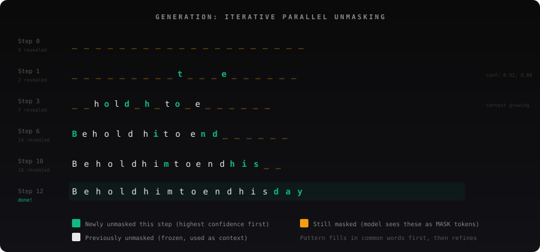

The algorithm:

```
1. Start with a prompt + all MASKs
2. Run the model — get predictions and confidence at every masked position
3. Unmask the most confident positions first
4. Repeat until no MASKs remain
```

How does the model decide which tokens to unmask first? "Confidence" is the maximum probability in the softmax distribution. If the model puts 85% on 'e' at position 7, it's sure. If the best prediction is 22%, it's uncertain.

> The model doesn't write left to right. It fills in what it's sure about first, then uses that skeleton to resolve the rest — like solving a crossword puzzle, not typing a sentence.

Why unmask confident predictions first? Because confident predictions are more likely correct, so they become reliable context for later predictions. Uncertain positions benefit from seeing more filled-in neighbors before committing.

What about longer text? Standard diffusion generates fixed-length output (256 tokens in our case). For longer text, we generate in blocks: produce 240 characters, use the last 16 as the prompt for the next block, repeat. This semi-autoregressive approach is the same one Mercury and MDLM use in production.

### What generation actually looks like

From the trained model on Shakespeare:

```
Step  0:  ____________________________________________  (all MASK)
Step  5:  _e___d_him_to___with_a_____________________
Step 15:  Behold him to him with a milling his________
Step 30:  Behold him to him with a milling his cold,
          As he should hold the sentenced of my heart.
```

Not perfect prose — but recognizably Shakespearean. Proper spacing, character names, dramatic cadence. From a 10.7M parameter model trained on 1MB of text.

---

## Part 6: Results — The Honest Comparison

Both models in microDLM share the exact same architecture: 6 transformer layers, 6 attention heads, 384 embedding dimension, 10.7M parameters. Trained on Tiny Shakespeare. Same optimizer, same learning rate.

The ONLY differences are the five changes. Here's what happened:

**GPT wins on loss.** I want to be honest about this. The autoregressive objective decomposes the joint probability exactly via the chain rule. Diffusion approximates it through a variational bound. MDLM's paper reports the same gap at scale.

But loss isn't the full picture:

**Speed:** Diffusion generates a 240-character block in ~39 denoising steps. GPT takes 240 sequential steps. On hardware that benefits from parallelism, diffusion has a structural advantage. Mercury runs at 1,000+ tokens/sec — 10× faster than comparable autoregressive models.

**Infilling:** Diffusion handles it naturally. Mask any position and the model fills it. GPT can only generate forward from a prefix.

**Constraint satisfaction:** At scale, diffusion models show surprising advantages. Dream (7B) scores 81.0 on Sudoku vs 21.0 for comparable autoregressive models. Parallel refinement lets the model check global consistency in ways left-to-right generation structurally cannot.

---

## Part 7: Where the Field Is Going

Building microDLM was my entry point into a landscape that's moving fast. Here's the trajectory:

**D3PM** (Austin et al., 2021) established the framework: define a forward Markov corruption, learn the reverse. It tried uniform noise, Gaussian noise, and absorbing state. Absorbing won.

**SEDD** (Lou, Meng & Ermon, ICML 2024 Best Paper) introduced "score entropy" — a loss based on the ratio $p(y)/p(x)$ between discrete states. First time a diffusion model beat GPT-2 on perplexity. This is the research that led directly to Inception Labs and Mercury.

**MDLM** (Sahoo et al., NeurIPS 2024) proved that the simpler absorbing-state approach, carefully engineered, matches SEDD. Its core insight — the ELBO is just weighted masked LM losses — is what makes the training code clean enough to fit in a blog post.

**LLaDA** (2025, 8B params) showed diffusion scales: competitive with LLaMA 3 on instruction following, using nothing more than a bidirectional transformer with uniform masking.

**Mercury** (Inception Labs, 2025-2026) brought it to production: 1,000+ tok/sec on H100s. Mercury 2 (February 2026) is the first reasoning dLLM — 91.1 on AIME 2025. When I attended the Ermon fireside chat at Stanford GSB, the thing that struck me was how the framing shifted from "can diffusion work for text?" to "what can't it do?"

**Block Diffusion** (ICLR 2025 Oral) hybridizes the two paradigms: generate blocks autoregressively, diffuse within each block. This recovers KV caching while keeping parallel generation within blocks.

The field is converging: absorbing-state masking is the default noise process, vanilla transformers are the default architecture. The open frontier is sampling (marginal vs joint distributions — recent work shows dLLM samplers may not converge without approaching autoregressive step counts), alignment (RLHF/DPO for diffusion), and continued scaling.

---

## Part 8: What I Learned Building This

**The math is cleaner than it looks.** When I first saw the ELBO derivation, it felt like five pages of symbol soup. Then I traced the absorbing-state case by hand and watched every KL divergence collapse to $-\log p(\text{correct token})$. The math wasn't complex — it was hiding how simple the answer is.

**The model diff from GPT is tiny.** I expected diffusion to require fundamentally different architecture. It doesn't. `is_causal=False`, one extra vocabulary token, and a different loss scope.

> I expected diffusion to require fundamentally different architecture. It doesn't. The five changes fit in a diff shorter than this paragraph.

**Bidirectional attention is powerful.** When I trained the MLP baseline (no attention), loss plateaued at ~3.3 — the model learned character frequencies but nothing contextual. The bidirectional transformer dropped it to ~1.9. Seeing the whole sequence lets the model make globally informed predictions that a left-to-right model structurally cannot.

**The generation paradigm is the real innovation.** Training is similar to BERT. The architecture is similar to GPT. What's genuinely new is how text gets generated — all at once with iterative refinement rather than left to right with no reconsideration. This is what gives diffusion models their documented advantages on planning, infilling, and constraint satisfaction.

After attending the Ermon fireside chat and building this from scratch, my sense is that the dLLM paradigm isn't going to replace autoregressive models — it's going to merge with them. Block Diffusion already hybridizes both. Mercury uses diffusion for speed-critical deployment. The future probably looks like models that switch between sequential precision and parallel speed depending on what the task demands.

---

## Try It Yourself

The complete code is at [github.com/BrutalCaeser/microDLM](https://github.com/BrutalCaeser/microDLM). You can also **[try the interactive demo](https://brutalcaeser.github.io/microDLM/)** to watch diffusion race GPT in real time.

The best way to understand diffusion language models is to build one. Not because the code is complex — it's surprisingly simple. But because every line of that simplicity sits on top of a mathematical structure that only makes sense when you've traced it yourself.

**Start from noise. End with Shakespeare. That's the whole idea.**

---

*Yashvardhan Gupta is a graduate student in AI at Northeastern University, focused on diffusion models and computer vision. He attended the Stefano Ermon dLLM fireside chat at Stanford GSB in March 2026. You can find more of his work on [GitHub](https://github.com/BrutalCaeser).*
